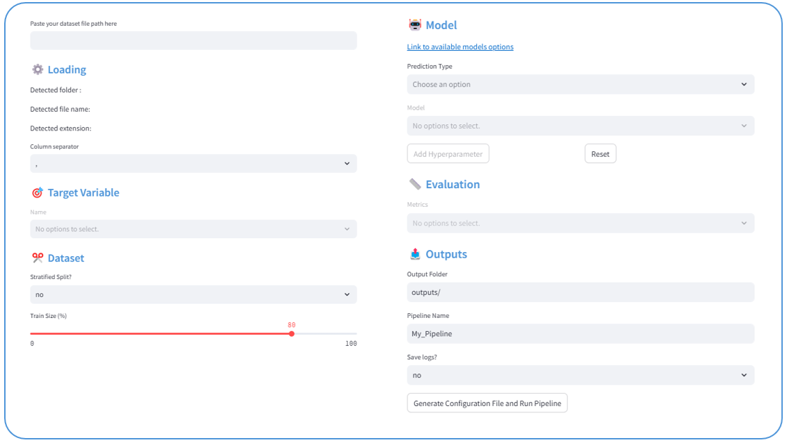

---

A **Streamlit-based app** to define and run basic machine learning pipelines *quickly* and *effortlessly*,
from data preprocessing to model training and evaluation.



### 1. Installation

#### Without Docker

````commandline
conda create -n lazy_ml_env python=3.11
conda activate lazy_ml_env
git clone https://github.com/GFaure9/lazy-ml-app.git
cd lazy-ml-app
pip install -r requirements
````

#### With Docker

If you have already installed Docker on your machine, you can also install the app by building
its image:

```commandline
git clone https://github.com/GFaure9/lazy-ml-app.git
cd lazy-ml-app
docker build -t lazy-ml-app .
```

### 2. Usage

#### Without Docker

```commandline
cd lazy-ml-app
streamlit run lazyml.py
```

#### With Docker

Once you have built the Docker image, in a terminal from anywhere you can run the following command to
launch the app:

```commandline
docker run -p 8501:8501 lazy-ml-app
```

> [!NOTE]
> This app is based on the package [yaml-ML](https://github.com/GFaure9/yaml-ML).
> To see what are the available options for preprocessing and model selection, please refer to the
> [yaml-ML documentation](https://gfaure9.github.io/yaml-ML/).
