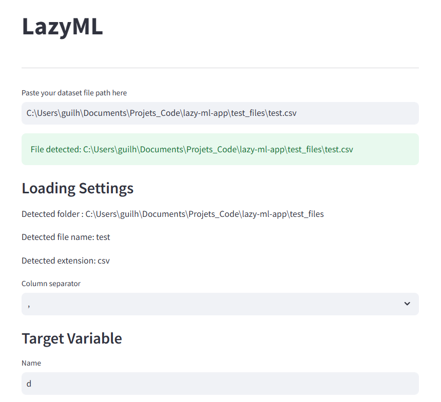
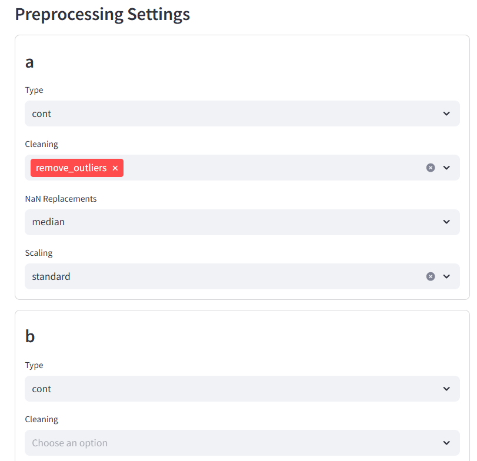
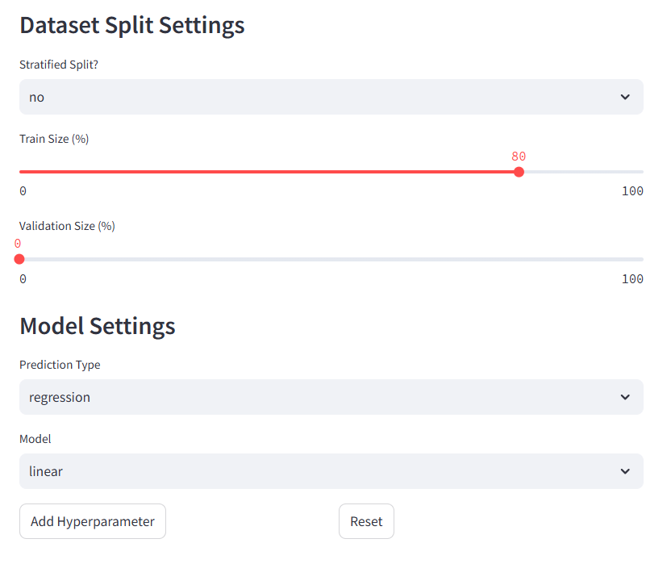
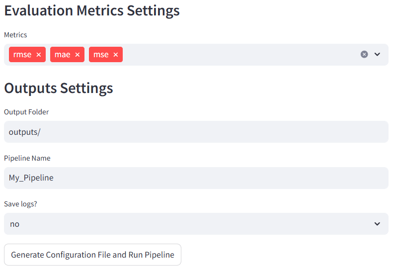
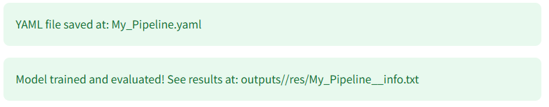

# LazyML

---

A Streamlit-based app to define and run ML pipelines effortlessly.

### Installation

````commandline
conda create -n lazy_ml_env python=3.11
conda activate lazy_ml_env
git clone https://github.com/GFaure9/lazy-ml-app.git
cd lazy-ml-app
pip install -r requirements
````

### Usage

```commandline
cd lazy-ml-app
streamlit run lazyml.py
```

### Demo





